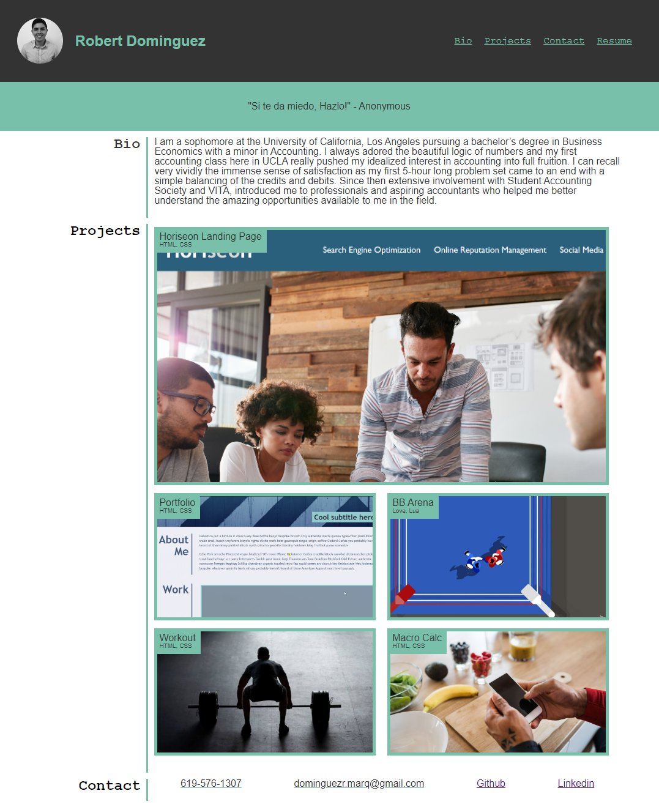

#challenge-2-portfolio

## Description

Welcome to my portfolio! It exists to exposee my work and provide more info on myself. The Site is divided into four sections: Header, Bio, Projects, and Contact.

The Header consists an image of yours truly along with my name and navigation links to the Bio, Projects, and Contact sections. There is also a link to download my resume.

The Bio section is a quick overview on my background and goals within the space.

The Projects provides clickable links to all of my deployed projects.

The Contact section consists of my contact info: number and email as well as links to my github and linkedin.

## Deployed Link

https://robdom87.github.io/challenge-2-portfolio/

## Screenshot

